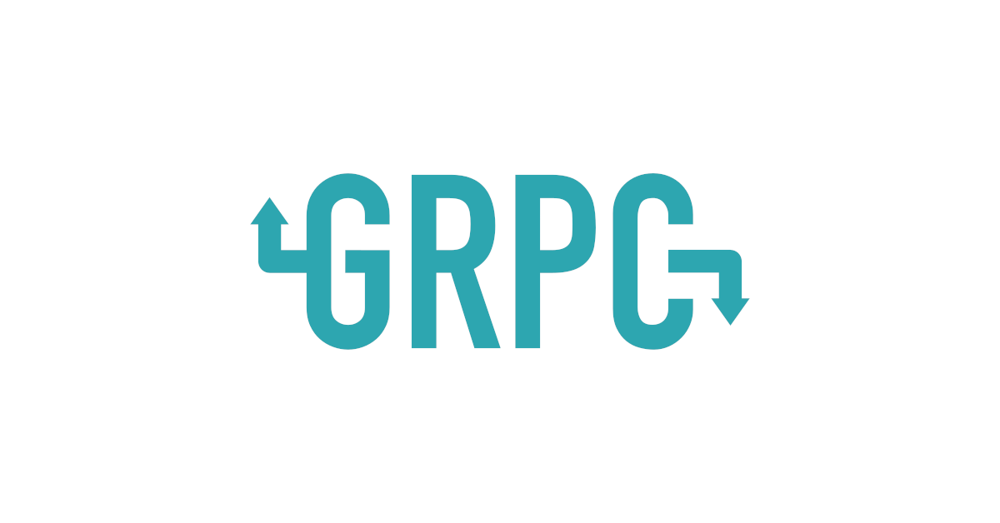
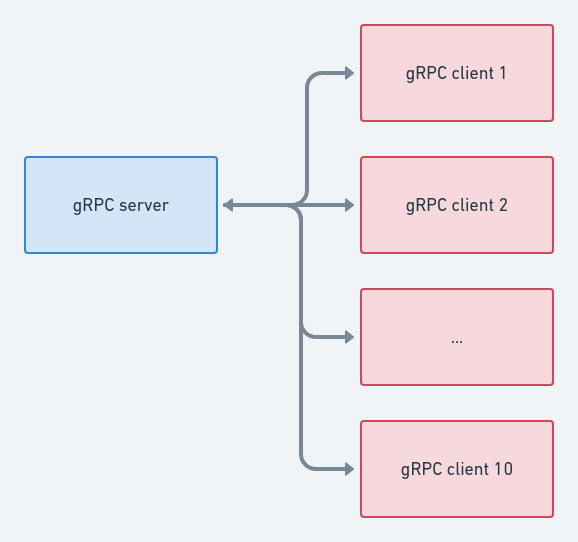
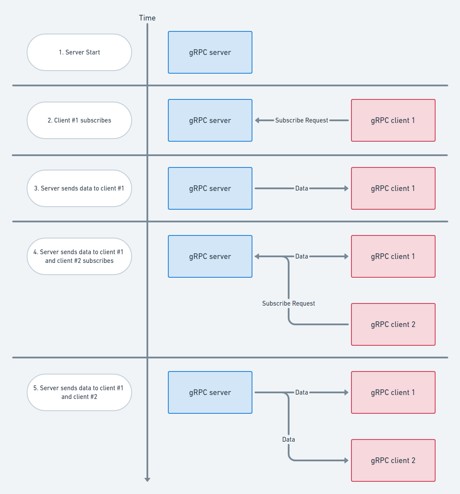

# gRPC长期流式传输【译】



###### 预计阅读时间：13分钟

​	在这篇博客文章中，我将探讨一种实现gRPC长期流式传输的方法。使用gRPC非常适合云原生应用程序，这主要是因为它很现代，带宽和CPU效率以及低延迟，这正是分布式系统所需的。

​	如果您正在阅读本文，我认为您已经熟悉gRPC。 但是，如果您仍然觉得需要介绍，请在下面留下评论，我也将整理一份gRPC入门文章。

### 什么被称为“长” RPC会话？

​	典型的RPC是立即请求-响应机制。 当提到长期存在的RPC时，你们中的某些人可能会想到不同的时间范围。

​	长期存在的RPC通常要比常规RPC的调用大一个数量级。例如，它可以持续数分钟，数小时，数天等，具体取决于您的用例。

​	在深入研究实现之前，我们首先考虑长期使用的RPC流的用例：

### 长期的RPC用例

​	现在，让我们重点介绍长期存在的RPC的一些主要用例。其中一些对于同一用例而言可能是不同的名称，但我想确保涵盖最常见的名称：

- **Watch API** - 修改API对象后，您要在其中获取通知的方式（类似于Kubernetes监视API机制）。

- **Notifications**  - 发生某些后端事件时，您希望立即收到有关该事件的通知。

- **Subscribers**  - 几种服务可以订阅事件并立即接收事件。 该用例还可以包括退订功能。

  请注意，我上面提到的所有用例都可以通过使用轮询来解决。 但是，如果您正在阅读本文，我想您应该避免轮询。 通过使用长寿命的流，您可以立即做出响应并减少事件的延迟。 可以将RPC的使用视为“管道”，它已设置并准备在任何给定时间处理事件。

### gRPC故障处理

​	使用gRPC的好处是它可以控制一些机制来帮助您处理故障。 其中一些是：

- [连接回退](https://github.com/grpc/grpc/blob/master/doc/connection-backoff.md) - 当我们与失败的后端进行连接时，通常不希望立即重试（以避免用请求淹没网络或服务器），而是执行某种形式的指数回退。
- [Keepalive](https://github.com/grpc/grpc/blob/master/doc/keepalive.md) - Keepalive ping是一种通过在传输上发送HTTP2 ping来检查通道当前是否正在工作的方法。 它是定期发送的，如果在一定的超时时间内对等方未确认ping，则传输断开。

​    这并不意味着您不需要处理网络故障的情况。 在设计生产等级系统时，您绝对应该考虑到这一点。

### 我们要建造什么？

​    以下GitHub存储库中提供了此处使用的所有代码：

​    `https://github.com/omri86/longlived-grpc`

​    为了使一切保持简单，并专注于如何使用gRPC，我们将创建一个由单个服务器和多个客户端组成的基本应用程序。 我选择与任意数量的10个客户端一起工作，但是正如您稍后将看到的，这很容易扩展：



###  应用流程

​    以下是构建此应用程序时我想到的一般流程。 注意，**顺序不是固定的**。 例如，客户端可以在服务器启动之前启动。

1. 服务器启动并等待客户端订阅
2. 客户端启动并向服务器发送订阅请求
3. 服务器订阅客户端
4. 服务器定期向客户端发送数据



一些注意事项：

- 如上所述，我们将有几个客户端，因此服务器将向每个客户端发送数据。
- 发送数据可以基于事件。 为了简单起见，我选择定期执行此操作。
- 每个组件都可以优雅地处理错误-稍后会详细介绍。

### 创建gRPC proto文件

​    在此处查看完整的proto文件：[longlived.proto](https://github.com/omri86/longlived-grpc/blob/master/protos/longlived.proto)

​    正如该帖子的标题所示，您将使用服务端流式RPC。 这是通过以下方式声明的：

```protobuf
service Longlived {
  rpc Subscribe(Request) returns (stream Response) {}
}
```

​    服务器将处理订阅请求（因此有Request参数），并将返回Response。 让我们看一下这两个对象：

```protobuf
message Request {
  int32 id = 1;
}
message Response {
  string data = 1;
}
```

​    `Request`对象拥有一个ID，这将是客户端标识符。`Response`对象保存数据–这是您将从服务器发送到订阅的客户端的数据。

​    proto文件还包含一个“取消订阅”一元RPC。 此功能将不会用作本教程的一部分，但可以为您提供有关如何退订的示例：

```protobuf
rpc Unsubscribe(Request) returns (Response) {}
```

### 创建服务端

​    在此处查看完整的服务端文件：[server.go](https://github.com/omri86/longlived-grpc/blob/master/server/server.go)

​    首先，让我们看一下服务端的结构体：

```go
type longlivedServer struct {
     protos.UnimplementedLonglivedServer
     subscribers sync.Map // subscribers is a concurrent map that holds mapping from a client ID to it's subscriber
 }
 type sub struct {
     stream   protos.Longlived_SubscribeServer // stream is the server side of the RPC stream
     finished chan<- bool                      // finished is used to signal closure of a client subscribing goroutine
 }
```

- 在[该线程](https://github.com/grpc/grpc-go/issues/3669)和此[README](https://github.com/grpc/grpc-go/blob/master/cmd/protoc-gen-go-grpc/README.md#future-proofing-services)文件中可以找到#2的解释。
- 订阅者结构体将保留每个订阅您的服务端的客户端。 它将保存从客户端ID到服务端流的映射，您将很快看到它的创建和用途。
- 由于服务器可以并行地将数据发送到订阅服务器并接收订阅请求，因此您需要确保没有冲突，这就是为什么需要并发映射的原因。
- `sub`结构体将保存为 map 值。 它代表一个拥有以下内容的订户：
  -   服务端流
  - 发出关闭流信号的通道

### 服务端订阅方法

​    为了实现在proto文件中定义的gRPC服务端接口，您需要实现以下方法：

```go
func (s *longlivedServer) Subscribe(request *protos.Request, stream protos.Longlived_SubscribeServer) error
```

​    此方法对来自客户端的每个传入订阅请求具有单独的上下文（专用`goroutine`）。 您将收到客户端请求和相应的流，该流用于将数据流传输到客户端。

​    关于此函数的重要说明是，**一旦此函数返回，流将关闭**。 只要订阅了客户端，此功能范围就必须保持活动状态。

### 订阅客户端

​    由于只要在单独的`goroutine`中订阅了客户端，此功能就会运行，因此您需要一种访问其流的方法，以便将数据发送到订阅的客户端。

​    您还需要一种方法来通知此`goroutine`在流关闭的情况下退出。

​    这就是为什么我们需要为每个客户流创建一个专用`channel`（`fin` channel）的原因。 我选择实现此机制的方法是将客户端ID映射到其对应的通道和流：

```go
fin := make(chan bool)
// Save the subscriber stream according to the given client ID
s.subscribers.Store(request.Id, sub{stream: stream, finished: fin})
```

​    而且，如上所述，需要保护对此映射的写入（或从中读取），这就是为什么我使用了并发映射。

​    您要做的最后一件事是等待`channel`上2个可能的事件之一：

	1. 发生错误时，您将发送一条消息通知该通道，请关闭该通道（您将在下面使用此通道的另一侧）。
	2. 发送给`ctx.Done`的消息–这是客户端断开连接的通信方式。

```go
for {
   select {
   case <-fin:
      log.Printf("Closing stream for client ID: %d", request.Id)
   case <- ctx.Done():
      log.Printf("Client ID %d has disconnected", request.Id)
      return nil
   }
}
```

### 创建客户端

​    在此处查看完整的客户端代码：[client.go](https://github.com/omri86/longlived-grpc/blob/master/client/client.go)

​    首先让我们来看一下客户端结构体：

```go
type longlivedClient struct {
   client protos.LonglivedClient // client is the long lived gRPC client
   conn   *grpc.ClientConn       // conn is the client gRPC connection
   id     int32                  // id is the client ID used for subscribing
}
```

- `client`代表gRPC客户端，我们将很快对其进行初始化。
- `conn`将保持gRPC连接（客户端<->服务器）
- 如服务器端所述，客户端正在订阅其唯一ID。 id字段是保存此ID的字段。

### 客户端订阅方法

​    为了订阅服务端更新，客户端必须调用gRPC `Subscribe()`函数。 这样做如下：

 ```go
 c.client.Subscribe(context.Background(), &protos.Request{Id: c.id})
 ```

- 可以将上下文设置为包含截止日期，取消信号等。 由于这不在本博客文章的讨论范围之内，因此您可以在[此处](https://golang.org/pkg/context/)了解更多信息。
- 传递给服务器的第二个值是保存客户端`id`的客户端请求。

### 开启客户端

​    订阅后，该流用于将数据从服务器流式传输到客户端：

```go
var stream protos.Longlived_SubscribeClient
```

​    客户端应该做的第一件事是按照上一节中的说明进行订阅：

```go
if stream == nil {
   if stream, err = c.subscribe(); err != nil {
      log.Printf("Failed to subscribe: %v", err)
      c.sleep()
      // Retry on failure
      continue
   }
}
```

​    如您所见，如果发生错误，我们只`sleep`几秒钟，然后尝试重新订阅。 这样做是为了确保客户端可以应对服务端器崩溃。 您需要确保客户端在服务器无响应的情况下继续重试连接。 稍后您将看到它如何工作。

​    客户端的下一部分和最后一部分是从流中接收数据：

```go
response, err := stream.Recv()
if err != nil {
   log.Printf("Failed to receive message: %v", err)
   // Clearing the stream will force the client to resubscribe on next iteration
   stream = nil
   c.sleep()
   // Retry on failure
   continue
}
log.Printf("Client ID %d got response: %q", c.id, response.Data)
```

### 创建实际的应用程序

​    现在基础已经明确，让我们运行我们的应用程序并查看其实际工作方式。

### 服务端的主要方法

​    您需要做的第一件事是初始化服务端：

```go
lis, err := net.Listen("tcp", "127.0.0.1:7070")
if err != nil {
   log.Fatalf("failed to listen: %v", err)
grpcServer := grpc.NewServer([]grpc.ServerOption{}...)

server := &longlivedServer{}
```

​    下一步是运行后台任务（goroutine）以生成数据并将其发送到订阅客户端：

```go
// Start sending data to subscribers
go server.mockDataGenerator()
```

​    此函数遍历订阅的客户端，并在其相应的流上发送数据：

```go
func (s *longlivedServer) mockDataGenerator() {
   log.Println("Starting data generation")
   for {
      time.Sleep(time.Second)

      // A list of clients to unsubscribe in case of error
      var unsubscribe []int32

      // Iterate over all subscribers and send data to each client
      s.subscribers.Range(func(k, v interface{}) bool {
         id, ok := k.(int32)
         if !ok {
            log.Printf("Failed to cast subscriber key: %T", k)
            return false
         }
         sub, ok := v.(sub)
         if !ok {
            log.Printf("Failed to cast subscriber value: %T", v)
            return false
         }
         // Send data over the gRPC stream to the client
         if err := sub.stream.Send(&protos.Response{Data: fmt.Sprintf("data mock for: %d", id)}); err != nil {
            log.Printf("Failed to send data to client: %v", err)
            select {
            case sub.finished <- true:
               log.Printf("Unsubscribed client: %d", id)
            default:
               // Default case is to avoid blocking in case client has already unsubscribed
            }
            // In case of error the client would re-subscribe so close the subscriber stream
            unsubscribe = append(unsubscribe, id)
         }
         return true
      })

      // Unsubscribe erroneous client streams
      for _, id := range unsubscribe {
         s.subscribers.Delete(id)
      }
   }
}
```

​    剩下的就是注册并启动服务端：

```go
// Register the server
protos.RegisterLonglivedServer(grpcServer, server)

log.Printf("Starting server on address %s", lis.Addr().String())

// Start listening
if err := grpcServer.Serve(lis); err != nil {
   log.Fatalf("failed to listen: %v", err)
}
```

​    您可以立即启动服务端：

```go
$ go build server.go
$ ./server
2021/03/04 08:48:09 Starting server on address 127.0.0.1:7070
2021/03/04 08:48:09 Starting data generation
```

### 客户端的主要方法

​    对于客户端，您将在同一过程中模拟多个客户端。 这可以轻松地单独完成：

```go
func main() {
   // Create multiple clients and start receiving data
   var wg sync.WaitGroup

   for i := 1; i <= 10; i++ {
      wg.Add(1)
      client, err := mkLonglivedClient(int32(i))
      if err != nil {
         log.Fatal(err)
      }
      go client.start()
      time.Sleep(time.Second*2)
   }

   // The wait group purpose is to avoid exiting, the clients do not exit
   wg.Wait()
}
```

​    服务器已经启动并且正在运行，因此让我们运行客户端：

```go
$ go build client.go
$ ./client
2021/03/04 09:19:29 Subscribing client ID: 1
 2021/03/04 09:19:29 Client ID 1 got response: "data mock for: 1"
 2021/03/04 09:19:30 Client ID 1 got response: "data mock for: 1"
 2021/03/04 09:19:31 Subscribing client ID: 2
 2021/03/04 09:19:31 Client ID 1 got response: "data mock for: 1"
 2021/03/04 09:19:31 Client ID 2 got response: "data mock for: 2"
 2021/03/04 09:19:32 Client ID 1 got response: "data mock for: 1"
 2021/03/04 09:19:32 Client ID 2 got response: "data mock for: 2"
 2021/03/04 09:19:33 Subscribing client ID: 3
 2021/03/04 09:19:33 Client ID 2 got response: "data mock for: 2"
 2021/03/04 09:19:33 Client ID 1 got response: "data mock for: 1"
 2021/03/04 09:19:33 Client ID 3 got response: "data mock for: 3"
 2021/03/04 09:19:34 Client ID 1 got response: "data mock for: 1"
 2021/03/04 09:19:34 Client ID 3 got response: "data mock for: 3"
 2021/03/04 09:19:34 Client ID 2 got response: "data mock for: 2"
 2021/03/04 09:19:35 Subscribing client ID: 4
 2021/03/04 09:19:35 Client ID 2 got response: "data mock for: 2"
 2021/03/04 09:19:35 Client ID 4 got response: "data mock for: 4"
```

​    如您所见，客户端正在启动，正在按预期方式订阅和接收数据。

### 错误处理

​    客户端和服务器都可以通过简单地重试连接来处理另一端的错误。

​    让我们通过停止服务器并查看客户端日志来进行测试：

```go
2021/03/07 19:38:43 Failed to receive message: rpc error: code = Unavailable desc = transport is closing
2021/03/07 19:38:48 Failed to subscribe: rpc error: code = Unavailable desc = connection error: desc = "transport: Error while dialing dial tcp 127.0.0.1:7070: connect: connection refused"
```

​    如您所见，由于传输流正在关闭，每个客户端都会首先收到RPC错误。 由于服务器未响应，因此导致错误未能订阅–因此发生了传输错误：`connect：连接被拒绝`。

​    现在，再次启动服务器，并停止客户端–让我们查看服务器日志：

```go
2021/03/07 19:43:04 Failed to send data to client: rpc error: code = Unavailable desc = transport is closing
```

​    与客户端相同的错误，但是由于我们删除了已订阅的客户端并重试，因此不会收到其他任何错误。

​    再次启动客户端将重新订阅客户端，并且您可以看到客户端和服务端都按预期工作。

### 结论

​    起初，对于长期流使用gRPC可能会有些令人生畏，但是从本示例中可以看出–不必一定如此！

​    gRPC项目非常适合云原生应用程序，并且具有出色的社区和文档。

### 原文链接

[gRPC Long-lived Streaming](https://dev.bitolog.com/grpc-long-lived-streaming/)
