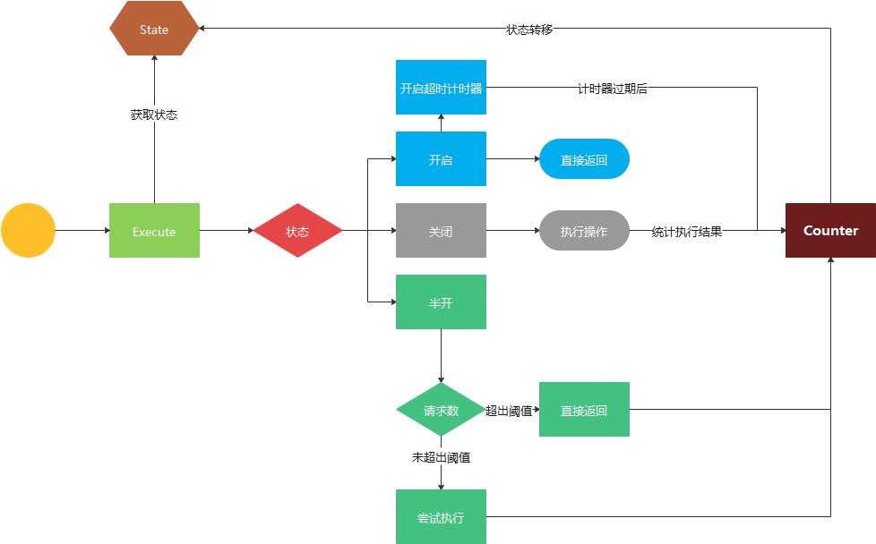

# 断路器原理及实现

### 断路器

断路器是指能够关合、承载和开断正常回路条件下的电流并能在规定的时间内关合、承载和开断异常回路条件下的电流的开关装置。

在软件系统中，断路器是指某个服务发生异常时，断开(阻止)此服务的请求，避免请求重试不可能成功的操作，以及由此服务导致整个服务的故障。

### 断路器使用场景

在分布式系统中，对远程资源的访问可能由于临时性故障（如网络连接缓慢、超时、资源过载或资源暂时不可用）而失败。这些故障通常会在短时间内自行更正。但是，也可能遇到意外事件而导致的故障，且需要更长的时间来修复。这些故障轻则导致部分连接中断，重则导致服务完全瘫痪。 这类情况下，让应用程序持续重试不可能成功的操作是毫无意义的。相反，应用程序应该快速认识到操作已失败，并相应地处理此故障。此外，如果服务十分繁忙，那么系统一个部分的故障可能会导致连锁故障。例如，调用服务的操作可以被配置为实现超时，并且在服务未能在此期间内响应时返回失败消息。但是，此策略可能导致同一操作的许多并发请求受到阻止，直至超时期间到期。这些阻止的请求可能占用了关键的系统资源，如内存、线程、数据库连接等。 因此，这些资源可能被耗尽，从而导致需要使用相同资源的系统其他不相关部分出现故障。 在这些情况下，更有益的做法便是让操作立即失败并只在服务可能成功时才尝试调用服务。 请注意，设置较短的超时可能有助于解决此问题，但为避免操作在大多数时间内失败，超时不应太短（即使对服务的请求最终会成功）。

### 断路器实现原理


#### 三种状态

- 关闭(Closed):服务正常访问。
- 开启(Open):服务异常。
- 半开(Half-Open):允许有限数量的请求通过吐过执行成功，恢复到关闭状态；如果仍然失败，则恢复到开放状态，然后重新启动超时计时器。

**注意**

- 半开状态对于防止恢复服务突然被大量请求淹没很有用。在服务恢复的同时，它或许能够支持数量有限的请求，直至恢复完成;但当恢复正在进行时，大量的工作可能导致服务超时或再次失败。
- 超时计时器的目的是给系统一段时间来解决导致失败的问题，并允许应用程序再次尝试执行操作。

#### 四种状态转换

- 关闭->开启:在断路器`关闭`状态时,对请求失败的次数进行计数，当失败的次数超过设置的阈值时，断路器切换到`开启`状态。
- 开启->半开:在断路器处于`开启`状态时，超时计时器启动，当此计时器过期时，状态变为`半开`状态。验证服务是否可用。
- 半开->开启:在断路器处于`半开`状态时，如果服务出现失败，则再次进入`关闭`状态
- 半开->关闭:在断路器处于`半开`状态时，如果请求都是成功的，则断路器`关闭`，所有请求将正常访问

#### 实现原理图解



#### 代码实现

##### 状态统计-计数器Counts

- Counts就是一个计数器，记录当前请求的成功次数与失败次数。为后续状态转移提供数据.

```
type Counts struct {
	Requests             uint32     //请求次数
	TotalSuccesses       uint32     //成功次数
	TotalFailures        uint32     //失败次数
	ConsecutiveSuccesses uint32     //连续成功次数
	ConsecutiveFailures  uint32     //连续失败次数
}
```

- OnRequest请求计数

```
func (c *Counts) OnRequest() {
	atomic.AddUint32(&c.Requests, 1)
}
```

- OnSuccess请求成功计数

```
func (c *Counts) OnSuccess() {
	atomic.AddUint32(&c.TotalSuccesses, 1)
	atomic.AddUint32(&c.ConsecutiveSuccesses, 1)
	atomic.StoreUint32(&c.ConsecutiveFailures, 0)
}
```

- OnFailure请求失败计数

```
func (c *Counts) OnFailure() {
	atomic.AddUint32(&c.TotalFailures, 1)
	atomic.AddUint32(&c.ConsecutiveFailures, 1)
	atomic.StoreUint32(&c.ConsecutiveSuccesses, 0)
}
```

- Reset状态转换后重置计数器

```
func (c *Counts) Reset() {
	atomic.StoreUint32(&c.Requests, 0)
	atomic.StoreUint32(&c.TotalSuccesses, 0)
	atomic.StoreUint32(&c.ConsecutiveSuccesses, 0)
	atomic.StoreUint32(&c.TotalFailures, 0)
	atomic.StoreUint32(&c.ConsecutiveFailures, 0)
}

```

##### 状态机-CircuitBreaker

```
type CircuitBreaker struct {
	name          string
    Close2Open ReadyToTrip     //close->open状态的转换逻辑，用于自定义转换逻辑
	Half2Open  ReadyToTrip     //halfopen->open状态的转换逻辑，用于自定义转换逻辑
	Half2Close ReadyToTrip     //halfopen->close状态的转换逻辑，用于自定义转换逻辑
	mutex      sync.Mutex
	State  State                //断路器当前状态
	Counts     Counts           //Counts计数器
	timeout       time.Duration //超时时间设置
	expireTime     time.Time    //超时过期时间，用于从open状态转换到hakf-open状态
}
```

- 状态

```
type State int

const (
	CloseState = iota
	HalfOpenState
	OpenState
)

```

##### 核心流程-Execute

- 对外开放的请求执行接口。

```
func (cb *CircuitBreaker) Execute(req func() (interface{}, error)) (interface{}, error) {
	if err := cb.beforeRequest(); err != nil {
		return nil, err
	}
	defer func() {
		if p := recover(); p != nil {
			cb.afterRequest(false)
			return
		}
	}()
	cb.Counts.OnRequest()
	resp, err := req()
	cb.afterRequest(err == nil)
	return resp, nil
}
```

- beforeRequest函数

执行请求前先判断断路器当前状态，若断路器不是开启状态，则可进入执行请求阶段。否则，判断当前开启状态的断路器是否已过定时计时器的时间，若已过，则说明断路器应转换为半开状态并可进入执行请求阶段，否则，断路器处于开启状态，直接返回，请求被拒绝。
```
var OpenStateError = errors.New("断路器正在开启中")

func (cb *CircuitBreaker) beforeRequest() error {
	if cb.State == OpenState {
		if cb.expireTime.Before(time.Now()) {
			cb.nextState(HalfOpenState)
			return nil
		}
		return OpenStateError
	}
	return nil
}
```

- afterRequest函数

若此次请求执行成功，则判断执行此次请求后断路器是否符合条件将状态转变为关闭状态。若失败则判断是否符合条件将状态转变为开启状态。

```
func (cb *CircuitBreaker) afterRequest(success bool) {
	if !success {
		cb.Counts.OnFailure()
		if cb.CloseToOpen(cb.Counts) {
			cb.nextState(OpenState)
		}
	} else {
		cb.Counts.OnSuccess()
		if cb.State == HalfOpenState {
			if cb.HalfToClose(cb.Counts) {
				cb.nextState(CloseState)
			}
		}
	}
}

func DefaultToOpen(counts Counts) bool {
	return counts.TotalFailures > 10
}

func DefaultToClose(counts Counts) bool {
	return counts.TotalSuccesses > 10
}

```

- nextState函数

进行状态转换。

```
func (cb *CircuitBreaker) nextState(state State) {
	cb.Mutex.Lock()
	defer cb.Mutex.Unlock()
	cb.Counts.Reset()
	switch cb.State {
	case CloseState:
		cb.State = OpenState
		cb.expireTime = time.Now().Add(cb.TimeOut)
		break
	case OpenState:
		cb.State = HalfOpenState
		break
	case HalfOpenState:
		if state == OpenState {
			cb.State = OpenState
			cb.expireTime = time.Now().Add(cb.TimeOut)
		} else {
			cb.State = CloseState
		}
	}
}

```

### 问题和注意事项

**异常处理**: 通过断路器调用操作的应用程序必须做好在操作不可用的情况下处理异常的准备。 异常的处理方式特定于应用程序。例如，应用程序可暂时降低其功能，调用替代操作来尝试执行相同的任务或获取相同的数据，或向用户报告异常并让他们稍后再试。

**异常的类型**: 请求可能由于多种原因而失败，其中一些原因可能指示比其他原因更严重的故障类型。 例如，由于远程服务已崩溃且需要数分钟才恢复，或服务临时超载而导致超时，请求可能会失败。 断路器可检查发生的异常的类型，并根据这些异常的性质来调整其策略。 例如，由于服务完全不可用，相比失败次数，有可能需要更多数量的超时异常才能使断路器跳闸至打开状态。

**日志记录**: 断路器应记录所有失败的请求（可能还有成功的请求），以使管理员能够监视操作的运行状况。

**可恢复性**: 应将断路器配置为匹配受其保护的操作的可能恢复模式。例如，如果断路器长期处于打开状态，即使故障原因已得到解决，它也可能引发异常。类似地，如果断路器从打开状态切换到半开状态的速度太快，则断路器可能会波动，并减少应用程序的响应时间。

**测试失败的操作**: 在打开状态中，断路器可定期执行对远程服务或资源的ping操作来决定其是否变得再次可用，而无需使用计时器来判断何时应切换至半开状态。此种ping操作可以尝试调用之前失败的操作，或使用由远程服务提供的专门用于测试服务运行状况的特殊操作，如运行状况终结点监视模式中所述。

**手动替代**: 在失败操作的恢复时间可变性极大的系统中，最好提供手动重置选项以便管理员能够关闭断路器（并重置失败计数器）。类似地，如果受断路器保护的操作暂时不可用，管理员可以强制断路器进入打开状态（并重新启动超时计时器）。

**并发性**: 应用程序的大量并发实例可以访问同一断路器。该实现不应阻止并发请求，或对操作的每个调用添加过多的开销。

**资源区分**: 在对一种类型的资源使用单个断路器时，请注意是否存在多个基础独立提供程序。例如，在包含多个分片的数据存储中，有可能能够完全访问一个分片，而另一个分片却遇到临时性问题。 如果将这些情况下的错误相应合并，则应用程序可能会尝试访问某些分片（即使失败的可能性很高），而对其他分片的访问则可能会被阻止（即使可能成功）。

**加速的断路**: 有时，失败响应可能包含足够的信息，以便断路器立刻跳闸，并在最短的时间内保持跳闸状态。 例如，来自超载的共享资源的错误响应可能指示不建议立即重试，且应用程序应改为在几分钟后再次尝试。

 `**备注**:如果服务限制客户端,则返回HTTP 429(请求过多);如果服务当前不可用,则返回HTTP 503(服务不可用)。响应可包括附加信息,如延迟的预期持续时间。`

**重播失败的请求**: 在打开状态下，断路器还可以将每个请求的详细信息记录到日志中，并安排这些请求在远程资源或服务可用时重播，而不是简单地快速失败。

**外部服务的不恰当超时**:对于配置有很长超时时间的外部服务中失败的操作，断路器可能无法完全保护应用程序不产生此类操作。如果超时过长，则在断路器指示操作已失败之前，可能会在较长时间内阻止运行断路器的线程。此时，许多其他应用程序实例也可能尝试通过断路器调用服务，并在它们全部失败之前占用大量的线程。

### 源码地址

[]()


### 参考文献

[微服务的断路器实现图解Golang通用实现](https://studygolang.com/articles/20441)

[微软云设计模式-断路器模式](https://docs.microsoft.com/en-us/azure/architecture/patterns/circuit-breaker#context-and-problem)

[gobreaker](https://github.com/sony/gobreaker)